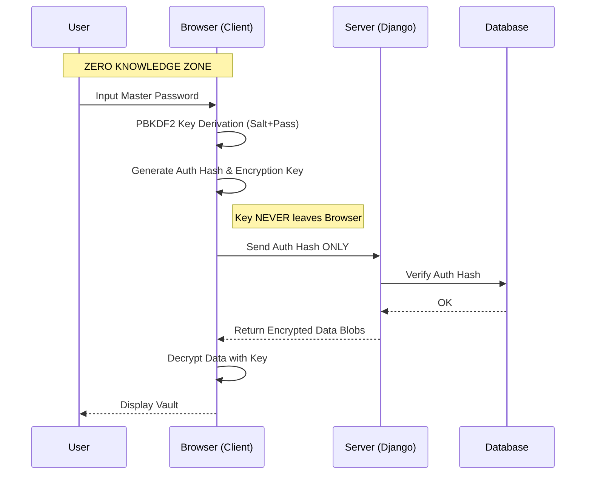

# AccountSafe

[](LICENSE)
[](frontend/)
[](backend/)
[](#why-accountsafe)

A self-hosted, zero-knowledge credential manager.

---

## Why AccountSafe

The server is blind.

AccountSafe encrypts all sensitive data in the browser before transmission. The server stores only ciphertext. A compromised database yields no usable information.



**The encryption key never leaves your device.**

---

## Features

### Zero-Knowledge Security
- **Zero-Knowledge Encryption**: AES-256-GCM with PBKDF2 key derivation (600k iterations)
- **Zero-Knowledge Authentication**: Password never leaves your device; only derived `auth_hash` is transmitted
- **Zero-Knowledge Export/Import**: Encrypted vault backup that only you can decrypt

### Active Defense
- **Duress Mode (Ghost Vault)**: Alternate password reveals a decoy vault with fake low-value credentials. Attacker sees "Netflix" and "Spotify" logins while your real vault remains hidden.
- **Canary Trap Credentials**: Plant fake credentials that trigger silent alerts when accessed. Know immediately if your exported data is compromised.
- **SOS Email Alerts**: Automatic notification to a trusted contact when duress mode is activated

### Security Intelligence
- **Security Health Score**: Real-time vault security assessment (password strength, reuse, age, breach status)
- **Breach Detection**: Integration with Have I Been Pwned API
- **Session Management**: View and revoke active sessions across devices

### Secure Sharing
- **Shared Secrets**: Time-limited, passphrase-protected credential sharing
- **Auto-Expiry**: Shared links automatically expire and self-destruct

### Convenience
- **Digital Wallet**: Visual credit card storage with masked display
- **Smart Import**: Bulk import from browser password exports (Chrome, Firefox, Edge)
- **Brand Detection**: Automatic logo fetching for organizations

### Data Safety
- **Automated Backups**: PostgreSQL dumps every 6 hours with 7-day retention
- **One-Command Restore**: Full disaster recovery via `./scripts/restore.sh`
- **Encrypted Backups**: Optional GPG encryption for backup files
- **Off-site Ready**: Backups stored in `./backups/` for easy S3/GCS sync

---

## Quick Start

### Production

```bash
git clone https://github.com/pankaj-bind/AccountSafe.git
cd AccountSafe
cp backend/.env.example backend/.env    # Configure backend settings
cp frontend/.env.example frontend/.env  # Configure frontend API URL
make init-ssl                            # Initialize Let's Encrypt certificates

# First deployment (builds images with pinned dependencies)
docker compose -f docker-compose.prod.yml up -d --build

# Subsequent runs (uses cached images)
docker compose -f docker-compose.prod.yml up -d
```

> **Note:** The `--build` flag is required on first run and after dependency updates. All dependencies are strictly pinned to prevent supply chain attacks.

**Migrating from another server?**
```bash
# Copy backups folder from old server, then:
./scripts/restore.sh
```

### Development

```bash
make dev  # Starts both backend and frontend with hot reload
```

Or manually:

```bash
# Backend
cd backend && python -m venv venv && source venv/bin/activate
pip install -r requirements.txt && python manage.py migrate && python manage.py runserver

# Frontend
cd frontend && npm install && npm start
```

---

## Architecture

| Component | Technology |
|-----------|------------|
| Frontend | React 18.3.1, TypeScript 4.9.5, Tailwind CSS |
| Backend | Django 5.2 LTS, Django REST Framework 3.15.2 |
| Database | PostgreSQL 15+ |
| Encryption | AES-256-GCM (Web Crypto API) |
| Key Derivation | PBKDF2 (600k iterations) / Argon2id |
| Auth | JWT with refresh rotation, Zero-Knowledge |
| Deployment | Docker Compose, Nginx, Let's Encrypt |

> **Dependency Policy:** All versions are strictly pinned (no `^` or `~`) to prevent supply chain attacks. See [CONTRIBUTING.md](CONTRIBUTING.md) for details.

---

## Documentation

| Document | Description |
|----------|-------------|
| [docs/API.md](docs/API.md) | API endpoints and request/response formats |
| [docs/CONFIGURATION.md](docs/CONFIGURATION.md) | Environment variables and deployment settings |
| [docs/DISASTER_RECOVERY.md](docs/DISASTER_RECOVERY.md) | Backup and restore runbook |
| [docs/ADMINISTRATION.md](docs/ADMINISTRATION.md) | System administration and operations guide |
| [CONTRIBUTING.md](CONTRIBUTING.md) | Development guidelines and code standards |
| [SECURITY.md](SECURITY.md) | Vulnerability reporting and security policy |

---

## Testing

```bash
make test            # All tests
make test-backend    # Backend only (pytest)
make test-frontend   # Frontend only (jest)
```

---

## License

MIT. See [LICENSE](LICENSE).
